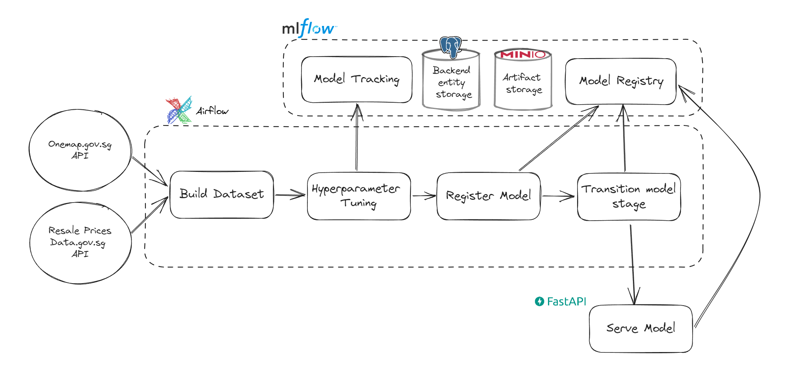
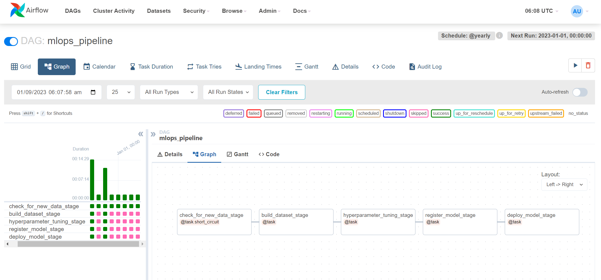

# End-to-end-ML-Engineering-Project

This project implements an entire ML pipeline for Singapore public housing resale price prediction. 

The ML models were inspired from this kaggle article: https://www.kaggle.com/code/lizexi/singapore-s-public-housing-eda-lasso-catboost#visualize-predictions

It uses MLFlow to manage model experimentation, tracking and serving. 

Airflow is used to schedule and orchestrate the whole pipeline to enable retraining overtime as new data becomes available and to account for data distribution shifts.

## Architecture
Everything runs locally through docker-compose

## Future Improvements
- [ ] Data versioning: Point in time records for features
- [ ] Use databases and feature stores instead of currently having repeated csv files
- [ ] Training the model with the full amount of data after hyperparameter tuning
- [ ] Model validation: Check if new model really outperforms current model before deployment
- [ ] Model could incorporate previous few years of resale prices for houses of the same type and the same town. This will be similar to ARIMAX model.
- [ ] Batch prediction API endpoint that works with a Spark cluster
- [ ] Instead of sending a post request to API to reload model, we could use an event bus to make it more robust
- [ ] Testing